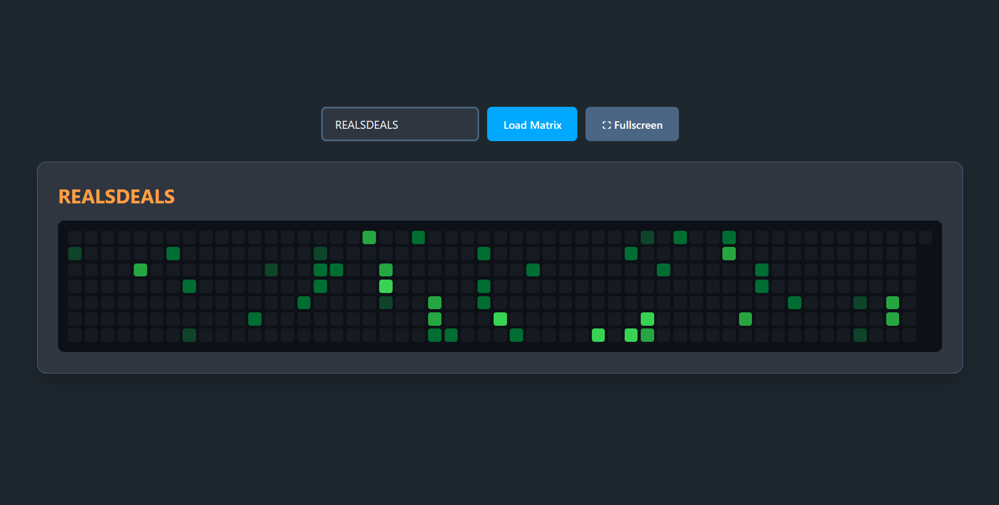

# Matrix Display

A responsive, self-hosted web dashboard that turns any screen—from (but specific) a 7-inch Raspberry Pi display to a desktop monitor—into a dedicated, retro-modern GitHub contribution clock.

## Features
* **No API Keys Required:** Simply enter a GitHub username and it instantly fetches public contribution data using a custom built-in scraper.
* **Fully Responsive:** Uses CSS Grid to automatically scale the contribution blocks perfectly to any screen size or orientation.
* **Hardware/Fullscreen Mode:** Includes a dedicated fullscreen button that hides all UI elements to mimic a physical LED clock.
* **Dockerized:** Easily deployable on any homelab or server with a single command.
* **Lightweight:** Built with a tiny Python/Flask backend and JS/CSS on the frontend.

## Getting Started

There are some ways or manners that you could go about it, you can run this yourself. See the guide on how to set this up via Docker, locally on your pc or server, or on a Raspberry Pi in Kiosk mode.
- **[Click here to read the Deployment Guide (HowTo.md)](documentation/howTo.md)** 

## Disclaimer && Contribution
I made this project for myself so I am contempt with how the design looks right now but if there are cool and nice ideas or optimizations, feel free to commit! 

## License
The MIT license has been applied to this project.